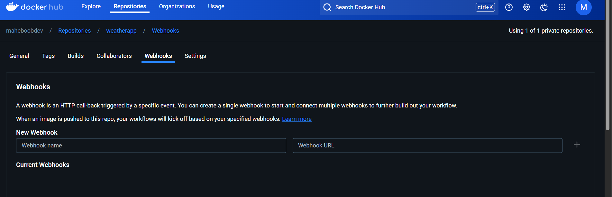

Create a Docker hub profile and PAT

Select Container option and than
Select Private Repo While creating WebAppEnter the Image Name

Enter the docker username and PAT

than go to deployment center after Creating the WebApp
and than select github 
Enable SCM authentication it will give prompt to do so.

You can set up webhook from docker as well

